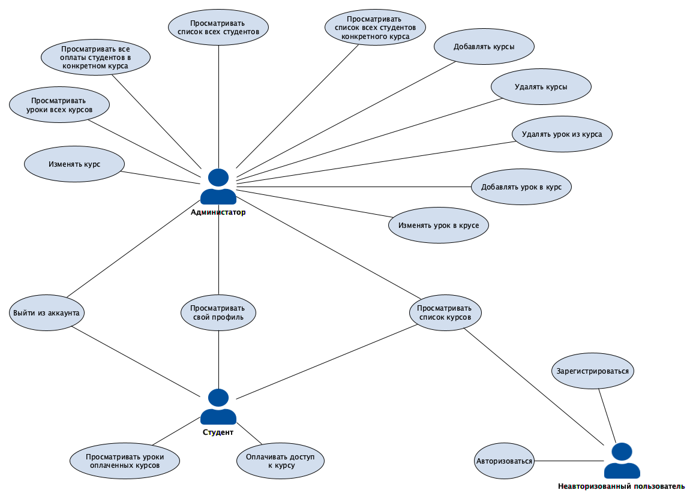
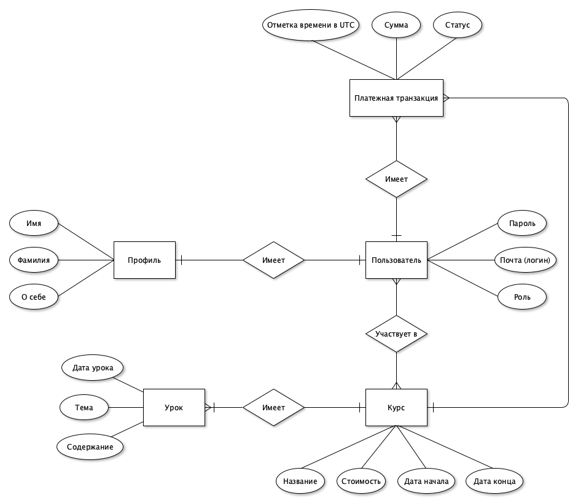
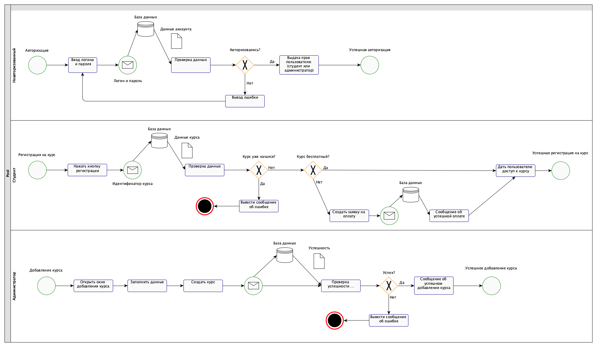
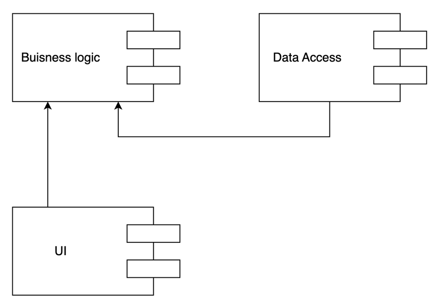
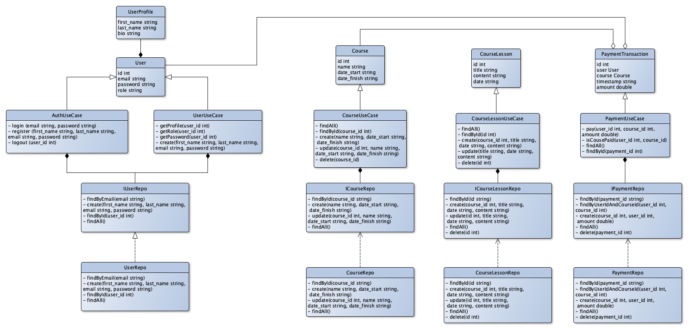
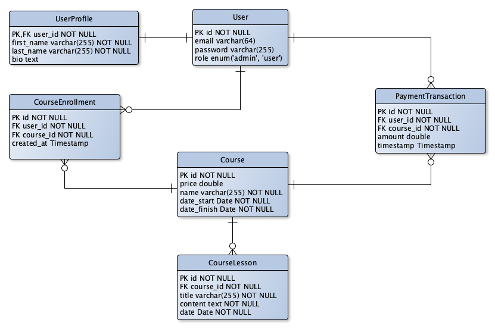

<!-- 
Исправления:
1) Дописать критерии ✅
2) В UML диаграмме не использовать квадратные стрелки ✅
3) Формализовать содержание курса: сущность урока в курсе с текстом ✅
4) В BPMN исправить выдачу прав пользователям при авторизации (парва пользователя и права админа - объелинить в одну проверку)
5) Добавить просмотр содержимого курса в use-case диаграмму и в пользовательские сценарии ✅
 -->

# 1. Название проекта: 
Школа онлайн курсов

# 2. Краткое описание идеи проекта:
Приложение позволяет студентам просматривать доступные курсы и покупать доступ к понравившися курсам. 
Администратор имеет возможность создавать курсы, просматривать участников курсов, просматривать оплаты участников, создавать выписки по зачислениям.

# 3. Краткое описание предметной области
Пользователи - все пользователи платформы, имеют несколько ролей: администратор и пользователь.
Курсы - все курсы, созданные администраторам
Платежные транзакции - все платежи, которые совершили пользователи

# 4. Краткий анализ аналогичных решений по минимум 3 критериям (1 таблица);
Аналогичные решения: яндекс практикум, онлайн школа Nisarga, онлайн школа Нетология
Критерии: есть ли роль куратора, количество пользователей, количество курсов

| Платформа                | Роль куратора | Количество пользователей | Количество курсов |
|--------------------------|--------------|--------------------------|-------------------|
| Яндекс Практикум         | Да           | 1 000 000+                | 100+             |
| Онлайн-школа Nisarga     | Да           | до 1000                   | до 100            |
| Онлайн-школа Нетология   | Нет           | 1 000 000+                | 500+              |

# 5. Краткое обоснование целесообразности и актуальности проекта (1 абзац);
Онлайн обучение очень востребовано сегодня, поэтому на рынке существует очень много подобных решений. Моя цель - создать скелетон для создания онлайн школ различной сложности, реализуя MVP приложения.

# 6. Краткое описание акторов (ролей);
Роли пользователей: 
- неавторизованный пользователь
- студент (авторизованный пользователь)
- администратор (авторизованный пользователь)

Администратор - роль пользователя с максимальными правами - он имеет все возможности студентов (кроме оплаты) и возможности администрирования онлайн школы.

# 7. Use-Case - диаграмма (обратить внимание на UML нотацию, отразить разных акторов пересечение их возможностей в приложении);

# 8. ER-диаграмма сущностей (не путать с диаграммой БД – диаграмма сущность-связь не приземлена на конкретную СУБД и показывает сущности системы, в том числе те, которые не будут персистентно храниться);

# 9. Пользовательские сценарии (не менее 3 типовых сценариев, в текстовом виде, расписанных по шагам, для разных акторов);
## Сценарий просмотра профиля:
1. Авторизоваться
2. Нажать кнопку профиль для просмотра профиля

## Сценарий регистрации на курс:
1. Авторизоваться
2. Выбрать курс
3. Нажать кнопку зарегистрироваться (если курс еще не начался)
4. Если курс бесплатный, то зарегистрировать пользователя на курс. Иначе показать окно оплаты с суммой оплаты и кнопкой.
5. Если показано окно оплаты, то при нажатии на кнопку создать транзакцию и показать пользователю сообщение об успешной оплате и зарегистрировать пользователя на курс.

## Сценарий добавления курса:
1. Авторизоваться как админ
2. Зайти в окно добавления курсов
3. Заполнить данные курса
4. Нажать кнопку добавить

## Сценарий добавления урока в курс
1. Авторизоваться как админ
2. Зайти на страницу курса
3. Перейти на страницу добавления урока
4. Заполнить данные
5. Нажать кнопку сохранения

# 10. Формализация ключевых бизнес-процессов (либо один основной комплексный бизнес процесс, либо 3-4 декомпозированных, небольших, используя BPMN-нотацию).

# Лабораторная работа №2
## 1. Описание типа приложения и выбранного технологического стека

Тип приложения - Web SPA.  
- Backend: NestJS, Typescript  
- Frontend: React, Typescript, SCSS  
- DB: Postgres, Redis  

## 2. Верхнеуровневое разбиение на компоненты

## 3. UML диаграмма классов и диаграмма сущностей БД

